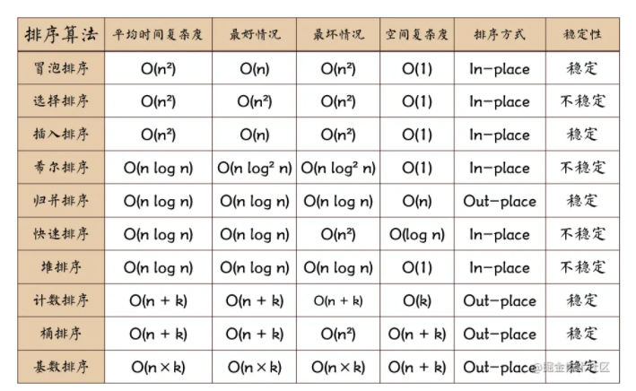

# leetcode-practice

算法练习

### 1. 五大算法

-   **贪心算法**: 局部最优解法
-   **分治算法**: 分成多个小模块，与原问题性质相同
-   **动态规划**: 每个状态都是过去历史的一个总结
-   **回溯法**: 发现原先选择不优时，退回重新选择
-   **分支限界法**: 找出满足约束条件的一个解，或是在满足约束条件的解中找出在某种意义下的最优解

### 2. 基础排序算法

n: 数据规模

k:“桶”的个数

In-place: 占用常数内存，不占用额外内存

Out-place: 占用额外内存
